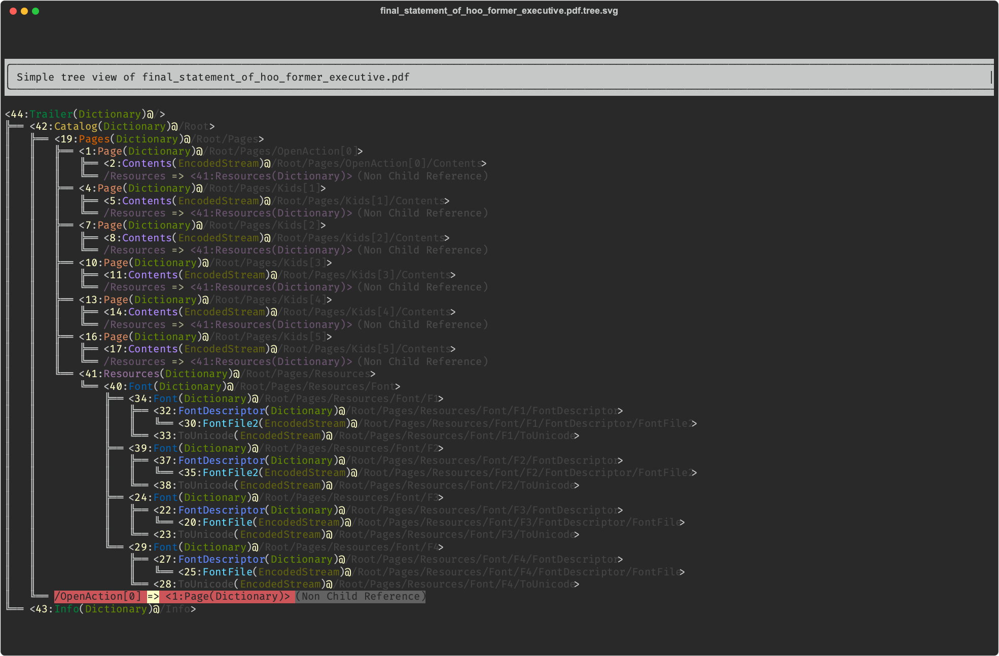
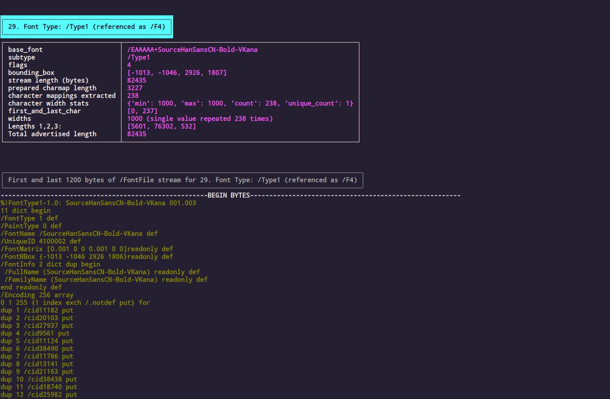
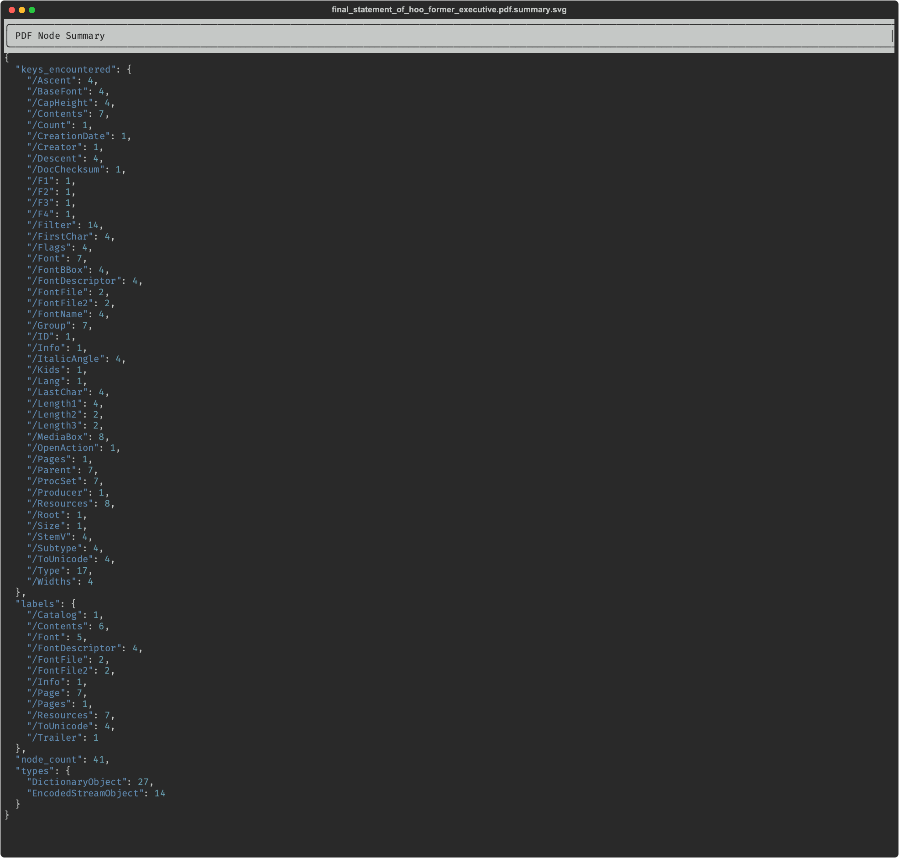

# the pdfalyzer
A PDF analysis tool geared towards combing the innards of possibly malicious PDFs written in python.

### What It Do
1. Generate summary format as well as in depth visualizations of a PDF's logical tree structure and binary streams, all with nice colors. See [the examples below](#example-output) to get an idea.
1. Scan for malicious content in the PDF, including in the font binaries where other tools don't look.
1. Be used as a library for your own PDF related code. All the inner PDF objects are available in a searchable tree data structure.
1. Ease the extraction of all the binary data in a PDF (fonts, images, etc) to separate files for further analysis.

If you're looking for one of these things this may be the tool for you.

An exception will be raised if there's any issue placing a node while parsing or if there are any nodes not reachable from the root of the tree at the end of parsing.

All internal PDF objects are guaranteed to exist in the tree except:
1. `/ObjStm` (object stream) objects which will be unrolled into the set of objects in the stream
2. `/XRef` Cross-reference stream objects which hold the same references as the `/Trailer`
Warnings will be printed in both situations.

### What It Don't Do
This tool is mostly about examining a PDF's logical structure and assisting with the discovery of malicious content. As such it doesn't have much to offer as far as extracting text from PDFs, rendering PDFs[^1], writing new PDFs, or many of the more conventional things one might do with a portable document.

[^1]: Given the nature of the tool this function in particular is not offered.

### Did The World Really Need Another PDF Tool?
This tool was built to fill a gap in the PDF assessment landscape. Didier Stevens's [pdfid.py](https://github.com/DidierStevens/DidierStevensSuite/blob/master/pdfid.py) and [pdf-parser.py](https://github.com/DidierStevens/DidierStevensSuite/blob/master/pdf-parser.py) are still the best game in town when it comes to PDF analysis tools but they lack in the visualization department and also don't give you much to work with as far as giving you a data model you can write your own code around. [Peepdf](https://github.com/jesparza/peepdf) seemed promising but turned out to be in a buggy, out of date, and more or less unfixable state. And neither of them offered much in the way of tooling for embedded font analysis.

All those things being the case lead to a situation where I felt the world might be slightly improved if I strung together a couple of more stable/well known/actively maintained open source projects ([AnyTree](https://github.com/c0fec0de/anytree), [PyPDF2](https://github.com/py-pdf/PyPDF2), and [Rich](https://github.com/Textualize/rich)) into this tool.


# Installation
1. `git clone https://github.com/michelcrypt4d4mus/pdfalyzer.git`
1. `cd pdfalyzer`

After that there's a forking path depending on whether or not you use [poetry](https://python-poetry.org) to manage your python lifestyle.

Note that the minimum versions for each package were chosen because that's what worked on my machine and not because that version had some critical bug fix or feature so it's entirely possible that using earlier versions than are specified in [pyproject.toml](pyproject.toml) or [requirements.txt](requirements.txt) will work just fine. Feel free to experiment if there's some kind of version conflict for you.

#### With Python Poetry
These commands are the `poetry` equivalent of the traditional virtualenv installation followed by `source venv/bin/activate` but there's a lot of ways to run a python script in a virtualenv with `poetry` so you do you if you prefer another approach.

```sh
poetry install
source $(poetry env info --path)/bin/activate
```

Note that `poetry.lock` is _not_ checked into this repo so as to allow more flexibility.

#### With A Manual `venv`
```sh
python -m venv .venv              # Create a virtualenv in .venv
. .venv/bin/activate              # Activate the virtualenv
pip install -r requirements.txt   # Install packages
```

**Troubleshooting the installation**
1. If you encounter an error building the python `cryptography` package check your `pip` version (`pip --version`). If it's less than 22.0, upgrade `pip` with `pip install --upgrade pip`.
2. On linux if you encounter an error building `wheel` or `cffi` you may need to install some packages like a compiler for the `rust` language or some SSL libraries. `sudo apt-get install build-essential libssl-dev libffi-dev rustc` may help.

### Installing Didier Stevens's PDF Analysis Tools
Stevens's tools provide comprehensive info about the contents of a PDF, are guaranteed not to trigger the rendering of any malicious content (especially `pdfid.py`), and have been battle tested for well over a decade. It would probably be a good idea to analyze your PDF with his tools before you start working with this one.

If you're lazy and don't want to retrieve his tools yourself there's [a simple bash script](scripts/install_didier_stevens_pdf_tools.sh) to download them from his github repo and place them in a `tools/` subdirectory off the project root. Just run this:

```sh
scripts/install_didier_stevens_pdf_tools.sh
```

If there is a discrepancy between the output of betweeen his tools and this one you should assume his tool is correct and `pdfalyzer` is wrong until you conclusively prove otherwise.

### Installing The `t1utils` Font Suite
`t1utils` is a suite of old but battle tested apps for manipulating old Adobe font formats.  You don't need it unless you're dealing with an older Type 1 or Type 2 font binary but given that those have been very popular exploit vectors in the past few years it can be extremely helpful. One of the tools in the suite, [`t1disasm`](https://www.lcdf.org/type/t1disasm.1.html), is particularly useful because it decrypts and decompiles Adobe Type 1 font binaries into a more human readable string representation.

There's [a script](scripts/install_t1utils.sh) to help you install the suite if you need it:

```sh
scripts/install_t1utils.sh
```


# Usage
1. Activate the virtualenv via your preferred method.
2. Run `./pdfalyzer.py -h` to see usage instructions.

As of right now these are the options:

```sh
usage: pdfalyzer.py [-h] [-d] [-t] [-r] [-f] [-c] [-txt OUTPUT_DIR] [-svg SVG_OUTPUT_DIR] [-x STREAM_DUMP_DIR] [-I] [-D] file_to_analyze.pdf

Build and print trees, font binary summaries, and other things describing the logical structure of a PDF. If no output sections are specified all sections will be printed to STDOUT in the order they are listed as command line options.

positional arguments:
  file_to_analyze.pdf   PDF file to process

options:
  -h, --help            show this help message and exit
  -d, --docinfo         show embedded document info (author, title, timestamps, etc)
  -t, --tree            show condensed tree (one line per object)
  -r, --rich            show much more detailed tree (one panel per object, all properties of all objects)
  -f, --fonts           show info about fonts / scan font binaries for dangerous content)
  -c, --counts          show counts of some of the properties of the objects in the PDF
  -txt OUTPUT_DIR, --txt-output-to OUTPUT_DIR
                        write analysis to uncolored text files in OUTPUT_DIR (in addition to STDOUT)
  -svg SVG_OUTPUT_DIR, --export-svgs SVG_OUTPUT_DIR
                        export SVG images of the analysis to SVG_OUTPUT_DIR (in addition to STDOUT)
  -x STREAM_DUMP_DIR, --extract-streams-to STREAM_DUMP_DIR
                        extract all binary streams in the PDF to files in STREAM_DUMP_DIR then exit (requires pdf-parser.py)
  -I, --interact        drop into interactive python REPL when parsing is complete
  -D, --debug           show debug log output
```

Beyond that there's [a few scripts](scripts/) in the repo that may be of interest.

### As A Library
The `PdfWalker` class is the core of the operation as it holds both the PDF's logical tree as well as a couple of other data structures that have been pre-processed to make them easier to work with. Chief among these is the `FontInfo` class which pulls together various properties of a font strewn across 3 or 4 different PDF objects.

Here's how to get at these objects:

```python
# Load a PDF and parse its nodes into the tree.
walker = PdfWalker("/path/to/the/evil.pdf")
actual_pdf_tree = walker.pdf_tree

# Find a PDF object by its ID in the PDF
node = walker.find_node_by_idnum(44)
pdf_object = node.obj

# Use anytree's findall_by_attr to find nodes with a given property
page_nodes = findall_by_attr(walker.pdf_tree, name='type', value='/Page')

# Get the fonts
fonts = walker.font_infos

# Extract all backtick quoted strings from a font binary
fonts[0].data_stream_handler.extract_backtick_quoted_strings()
```

The representation of the PDF objects (e.g. `pdf_object` in the example above) is handled by [PyPDF2](https://github.com/py-pdf/PyPDF2) so for more details on what's going on there check out its documentation.

### Troubleshooting
This tool is by no means complete. It was built to handle a specific use case which encompassed a small fraction of the many and varied types of information that can show up in a PDF. While it has been tested on a decent number of large and very complicated PDFs (500-5,000 page manuals from Adobe itself) I'm sure there are a whole bunch of edge cases that will trip up the code.

If that does happen and you run into an issue using this tool on a particular PDF it will most likely be an issue with relationships between objects within the PDF that are not meant to be parent/child in the tree structure made visible by this tool. There's not so many of these kinds of object references in any given file but there's a whole galaxy of possibilities and they must each be manually configured to prevent the tool from building an invalid tree.  If you run into that kind of problem take a look at these list constants in the code:

* `NON_TREE_REFERENCES`
* `INDETERMINATE_REFERENCES`

You might be able to easily fix your problem by adding the Adobe object's reference key to the appropriate list.


# Example Output
`pdfalyzer` has a command line flag to export SVG images using the SVG generation functionality that comes with [Rich](https://github.com/Textualize/rich). Those SVGs can then be turned into `png` format images with a tool like `cairosvg`.


## Basic Tree View
As you can see the "mad sus" `/OpenAction` relationship is highlighted bright red, as would be a couple of other suspicious PDF instructions like `/JavaScript` that don't exist in the PDF but do exist in other documents.

The dimmer (as in "harder to see") nodes[^2] marked with `Non Child Reference` give you a way to visualize the relationships between PDF objects that exist outside of the tree structure's parent/child relationships.



That's a pretty basic document. If you'd like to see the tree for a more complicated/longer PDF, [here's an example showing the `nmap` cheat sheet](doc/svgs/svgs_rendered_as_png/NMAP_Commands_Cheat_Sheet_and_Tutorial.pdf.tree.svg.png).

[^2]: Technically they are `SymlinkNodes`, a really nice feature of [AnyTree](https://github.com/c0fec0de/anytree).

## Rich Tree View
This image shows a more in-depth view of of the PDF tree for the same document shown above. This tree (AKA the "rich" tree) has almost everything - shows all PDF object properties, all relationships between objects. Even includes sizable previews of any binary data streams embedded or encrypted in the document.


## Font Analysis (And Lots Of It)
### View the Properties of the Fonts in the PDF
Comes with a preview of the beginning and end of the font's raw binary data stream (at least if it's that kind of font).



### Extract Character Mappings from Ancient Adobe Font Formats
It's actually `PyPDF2` doing the lifting here but we're happy to take the credit.


### Search Encrypted Binary Font Data for #MadSus Content No Malware Scanner Will Catch[^3]
Things like, say, a hidden binary `/F` (PDF instruction meaning "URL") followed by a `JS` (I'll let you guess what "JS" stands for) and then a binary `»` character (AKA "the character the PDF specification uses to close a section of the PDF's logical structure"). Put all that together and it says that you're looking at a secret JavaScript instruction embedded in the encrypted part of a font binary. A secret instruction that causes the PDF renderer to pop out of its frame prematurely as it renders the font.

[^3]: At least they weren't catching it as of September 2022.


## Compute Summary Statistics About A PDF's Inner Structure
Some simple counts of some properties of the internal PDF objects. Not the most exciting but sometimes helpful. `pdfid.py` also does something much like this.




# Resources
#### Official Adobe Documentation
* [Official Adobe PDF 1.7 Specification](https://opensource.adobe.com/dc-acrobat-sdk-docs/standards/pdfstandards/pdf/PDF32000_2008.pdf) - Indispensable map when navigating a PDF forest.
* [Adobe Type 1 Font Format Specification](https://adobe-type-tools.github.io/font-tech-notes/pdfs/T1_SPEC.pdf) - Official spec for Adobe's original font description language and file format. Useful if you have suspicions about malicious fonts. Type1 seems to be the attack vector of choice recently which isn't so surprising when you consider that it's a 30 year old technology and the code that renders these fonts probably hasn't been extensively tested in decades because almost no one uses them anymore outside of people who want to use them as attack vectors.
* [Adobe CMap and CIDFont Files Specification](https://adobe-type-tools.github.io/font-tech-notes/pdfs/5014.CIDFont_Spec.pdf) - Official spec for the character mappings used by Type1 fonts / basically part of the overall Type1 font specification.
* [Adobe Type 2 Charstring Format](https://adobe-type-tools.github.io/font-tech-notes/pdfs/5177.Type2.pdf) - Describes the newer Type 2 font operators which are also used in some multiple-master Type 1 fonts.

#### Other Stuff
* [Didier Stevens's free book about malicious PDFs](https://blog.didierstevens.com/2010/09/26/free-malicious-pdf-analysis-e-book/) - The master of the malicious PDFs wrote a whole book about how to analyze them. It's an old book but the PDF spec was last changed in 2008 so it's still relevant.
* [Analyzing Malicious PDFs Cheat Sheet](https://zeltser.com/media/docs/analyzing-malicious-document-files.pdf) - Like it says on the tin. If that link fails there's a copy [here in the repo](doc/analyzing-malicious-document-files.pdf).
* [T1Utils Github Repo](https://github.com/kohler/t1utils) - Suite of tools for manipulating Type1 fonts.
* [`t1disasm` Manual](https://www.lcdf.org/type/t1disasm.1.html) - Probably the most useful part of the T1Utils suite because it can decompile encrypted ancient Adobe Type 1 fonts into something human readable.


# Contributing
Contributions are welcome, just make sure:
1. The test suite passes (run by typing `pytest`)
1. You add a description of your changes to [the changelog](CHANGELOG.md)
Before you open a pull request.

If your pull request includes some `pytest` setup/unit testing you'll be my new favorite person.

### Testing
Run tests by typing `pytest`. Test coverage is relatively spartan but should throw failures if you really mess something up.
